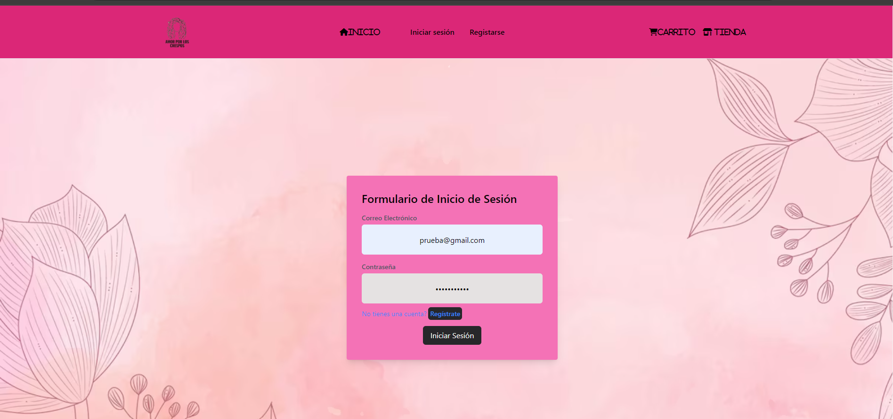
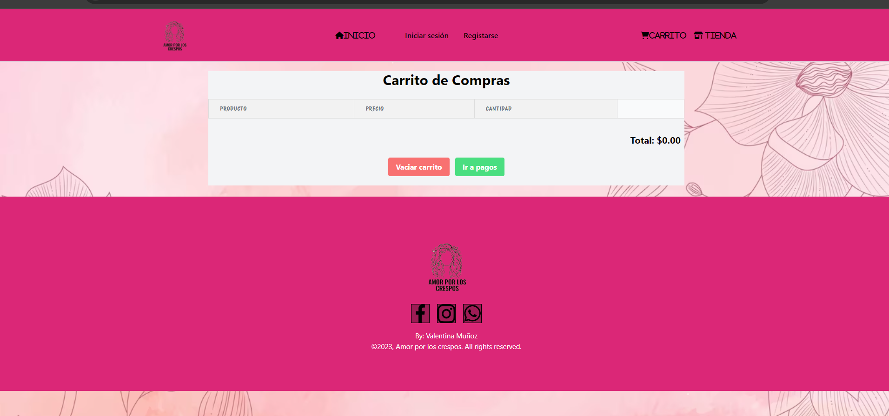

# Ecommerce

## Descripción

Este es un proyecto de eCommerce desarrollado con el stack MERN (MongoDB, Express.js, React.js y Node.js). Permite a los usuarios navegar por productos, agregar artículos al carrito y realizar compras de manera sencilla.

## Características

- Registro y autenticación de usuarios
- Navegación por productos
- Agregar productos al carrito
- Proceso de compra
- Panel de administración para gestionar productos

## Tecnologías Utilizadas

- **Frontend:** React.js, Redux, Axios
- **Backend:** Node.js, Express.js
- **Base de Datos:** MongoDB
- **Autenticación:** JWT (JSON Web Token)

## Capturas de Pantalla

### Página de Inicio


### Login



### Carrito de Compras



## Instalación

### Clonar el repositorio

```bash
git clone https://github.com/edwarenrique2704/ecommerce.git


Configurar el frontend
Navega a la carpeta del frontend:

cd frontend

Instala las dependencias:

npm install

Inicia la aplicación:
npm run dev

Uso
Abre tu navegador y ve a http://localhost:7000 para acceder a la aplicación.
Regístrate o inicia sesión para comenzar a explorar los productos.

Licencia
Este proyecto está licenciado bajo la Licencia MIT.

Contacto
Si tienes alguna pregunta, no dudes en contactarme:

Edward garcia
edwarenrique2704

